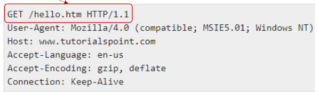

# Topic 2

**HTTP basics in the protocol stack**

- HTTP sits at the application/data layer above the TCP in the IoT protocol stack
    - Alongside other protocols like MQTT and CoAP
    - Lower layers include
        - IPv4/IPv6/RPL/6LoWPAN
        - IEEE 802.15.4/BLE
        - physical media such as
            - Wi-Fi, HaLow
            - RFID/NFC
            - LoRa
            - 3GPP technologies
- HTTP communication is client-server:
    - a client establishes a TCP connection to a server
    - sends a request
        - i.e. GET or POST
    - Server returns the requested content
    - Connection is usually closed
- Web Content → “a sequence of bytes with an associated MIME type”
    - e.g. text/html, text/plain, application/postscript, image/gif, image/jpeg
    - all web content ultimately corresponds to a file managed by the server
        - either static or dynamically generated
- Static content is pre-stored (HTML, images, audio clips)
    - dynamic content → generated on the fly by server programs in response to requests
        - e.g. CGI scripts or application logic

**URLs and HTTP messages**

- Each file/resource that is managed by a web server is identified by a URL
    - Static example:
        - [http://www.singaporetech.edu.sg/index.htm](http://www.singaporetech.edu.sg/index.html)l
    - Dynamic example:
        - [http://www.singaporetech.sg:8080/cgi-bin/simi?15432&223](http://www.singaporetech.sg:8080/cgi-bin/simi?15432&223)
    - Dynamic example invokes executable “simi” on port 8080 with arguments 15432 and 223
- HTTP requests consist of a request line, followed by zero or more request headers
- Request line: <method> <url> <version>
    - <version> is HTTP version of request (HTTP/1.0 or HTTP/1.1)
    - <url> is typically URL for proxies and servers
    - <method> is either:
        - GET
        - POST
        - OPTIONS
        - HEAD
        - PUT
        - DELETE
        - TRACE
- HTTP requests:
    - HTTP Methods:
        - GET: Retrieve static or dynamic content
            - Arguments for dynamic content are in URI
            - Workhorse method (99% of requests)
        - POST: Retrieve dynamic content
            - Arguments for dynamic content are in the request body
        - OPTIONS: Get server or file attributes
        - HEAD: Similar to GET but no data in response body
        - PUT: Write a file to the server
        - DELETE: Delete a file on the server
        - TRACE: Echo request in response body
            - Useful for debugging
        
        
        
- HTTP Responses
    - HTTP response is a response line followed by zero or more response headers
    - Response line: <version> <status code> <status msg>
        - <version> is HTTP version of response
        - <status code> is numeric status
        - <status msg> is corresponding English text
            - 200 → Ok → request was handled without error
            - 403 → ForbiddenServer lacks permission to access file
            - 404 → Not found server could not find the file
    - Response headers: <header name>: <header data>
        - provide additional information about response
        - Content-Type:
            - MIME type of content in response body
        - Content Length:
            - Length of content in response body
    - Example:
        
        
        
- Full Example of HTTP Transaction from an IoT Device via Telnet
    
    
    

**REST API**

- REST ⇒ REpresentational State Transfer
- Web standards-based architecture
    - Uses HTTP Protocol
- REST = NOT A PROTOCOL
- REST = architectural style
- Every component = resource that is accessed via HTTP protocols
- Can adopt several standards:
    - HTTP
    - URL
    - XML
    - HTML
    - GIF
    - JPEG
- REST = take advantage of the success of web
    - URI Addressable resources → URL
    - HTTP Protocol
    - Request → Response → Display Response
- Makes use of HTTP Protocol beyond POST / GET
    - HTTP PUT
    - HTTP DELETE
- URI → identifier
- URL → Identifier that tells you how to get to it
    
    
    

**6 Architectural Constraints of REST**

- Client-Server Architecture
    - Client and server act independently
- Statelessness
    - Server does not record the state of the client
- Cacheable
    - Server marks whether data is cacheable
- Layered System
    - Application behaves the same regardless of any intermediaries between client and server
- Uniform Interface
    - Client and server interact in a uniform and predictable way
    - Important aspect = server exposes resources
- Code on demand (optional)
    - Allows client functionality to be extended by downloading and executing code in the form of applets or scripts
    - Simplifies clients by:
        - reducing the number of features required to be pre-implemented
    - Downloading features after deployment improves system extensibility

**REST vs RESTful**

**Resource / Naming Resources**

- Key abstraction of information in REST = resource
- Resource = conceptual mapping to a set of entities
    - Any information that can be named can be a resource:
        - document / image
        - temporal service (today’s weather in Berlin)
        - collection of other resources
        - non-virtual object
- Represented with a global identifier (URI in HTTP)
- REST uses URI to identify resources
    
    
    

**REST Verbs**

**GET**

- How clients ask for the information they seek
- Issuing a GET request transfers the data from the server to the client in some representation
- GET [http://localhost/books](http://localhost/books)
    - Retrieve all books
- GET [http://localhost/books/ISBN-0011021](http://localhost/books/ISBN-0011021)
    - Retrieve book identified with ISBN-0011021
- GET [http://localhost/books/ISBN-0011021/authors](http://localhost/books/ISBN-0011021/authors)
    - Retrieve authors for book identified with ISBN-0011021

**POST, PUT & PATCH**

- HTTP POST creates a resource
    - Not idempotent (multiple requests create multiple entries)
- HTTP PUT updates the (entire) resource
    - Idempotent (multiple requests produce the same result)
- POST [http://localhost/books/](http://localhost/books/)
    - Content: {“isbn”: “111-456-789”, “title”: “The Boring Two”, “authors”: …}
    - Creates a new book with given properties
    - Response: 201 Created with the new book details
    
    
    
- PUT [http://localhost/books/isbn-111](http://localhost/books/isbn-111)
    - Content: {“isbn”: “123-456-789”, “title”: “The Boring One”, “authors”: …}
    - Update book identified by isbn-111 with submitted properties
    - Response: 200 OK with updated book details.
    
    
    
- PATCH [http://localhost/books/isbn-111](http://localhost/books/isbn-111)
    - Content: {“title”: “The Boring One”}
    - Update book identified by isbn-111 with submitted properties
    - Response: 200 OK with updated book title.
    
    
    

**DELETE**

- HTTP Request: Client → Server
    
    
    
- HTTP Response: Server → Client
    
    
    
- Idempotent → Deleting twice has the same result

**Representations**

- Data is represented or returned to the client for presentation
- Typical formats:
    - JavaScript Object Notation (JSON)
    - Extensible Markup Language (XML)
    
    
    

**RESTful for IoT**

- Best Practices:
    - Use clear, hierarchical resource names
        - E.g. /devices/{id}/status
    - Keep APIs stateless
    - Prefer lightweight data (JSON)
    - Secure endpoints (authentication, HTTPS)
- Security Note:
    - Exposing device controls via HTTP can be risky
    - Always use authentication and HTTPS
    - Limit access and validate all inputs

**Limitations of HTTP for IoT**

- High Overhead
    - Large headers and text-based format increase message size and complexity, making HTTP inefficient for small IoT payloads
- Request-Response Model
    - Synchronous communication is not ideal for real-time or event-driven IoT
    - Devices must poll for updates, raising traffic and energy use
- Latency and Connection Management
    - Each request needs a new TCP connection, causing extra latency and power drain
    - HTTP/2 helps, but is still less efficient than IoT specific protocols
- Not Optimized for Constrained Networks
    - Protocols like LoRa and Zigbee do NOT support HTTP due to its overhead
    - HTTP suits high-bandwidth, always-on networks, not low-power or lossy IoT environments
- Security Concerns
    - Data is sent in plaintext unless using HTTPS, which adds computational and bandwidth overhead, challenging for resource-limited devices

**Comparison HTTP, MQTT, CoAP**

| Feature | HTTP | MQTT | CoAP |
| --- | --- | --- | --- |
| Model | Request-Response | Publish-Subscribe | Request-Response |
| Overhead | High (text headers) | Low (2-byte header) | Very Low (binary, compact) |
| Bandwidth | High | Low | Very Low |
| Suitability | Web, dashboards | Sensors, telemetry, alerts | Constrained devices, M2M |
| Power Usage | High | Low | Very Low |
| Security | HTTPS (TLS) | TLS, Username/password | DTLS |
| Reliability | Reliable (TCP) | QoS Levels 0-2 | Confirmable messages |
| Scalability | Moderate | High | High |

**Summary - HTTP & REST in IoT**

- Definitions
    - HTTP = foundation of web communication, using **request-response** interactions
    - REST = **architectural style** that leverages HTTP for scalable and structured APIs
- IoT relevance
    - IoT devices use RESTful APIs to allow remote monitoring, device control and data retrieval
    - Well-suited for **high-bandwidth**, internet-connected IoT applications
        - e.g. smart homes, industrial dashboards
- Challenges
    - High overhead:
        - (Relatively large) HTTP headers make it inefficient for low-power devices
    - Request-response model:
        - Not ideal for real-time or event-driven IoT applications
    - Latency:
        - REST APIs require a new connection for each request, increasing delays
    - Not optimized for constrained networks:
        - LoRa and Zigbee don’t directly support HTTP
- Overcoming These Challenges
    - MQTT (Message Queuing Telemetry Transport)
        - A lightweight protocol for low-bandwidth, real-time communication via publish-subscribe messaging
    - CoAP (Constrained Application Protocol)
        - A REST-based protocol optimized for low-power, constrained devices with a smaller message format